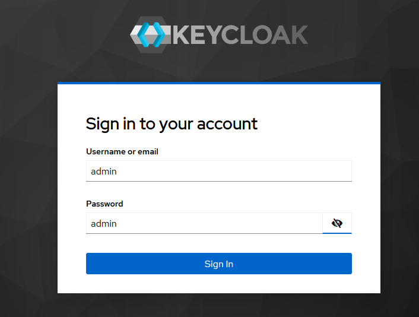
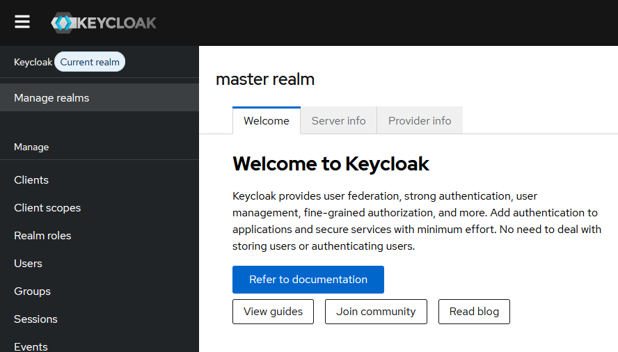
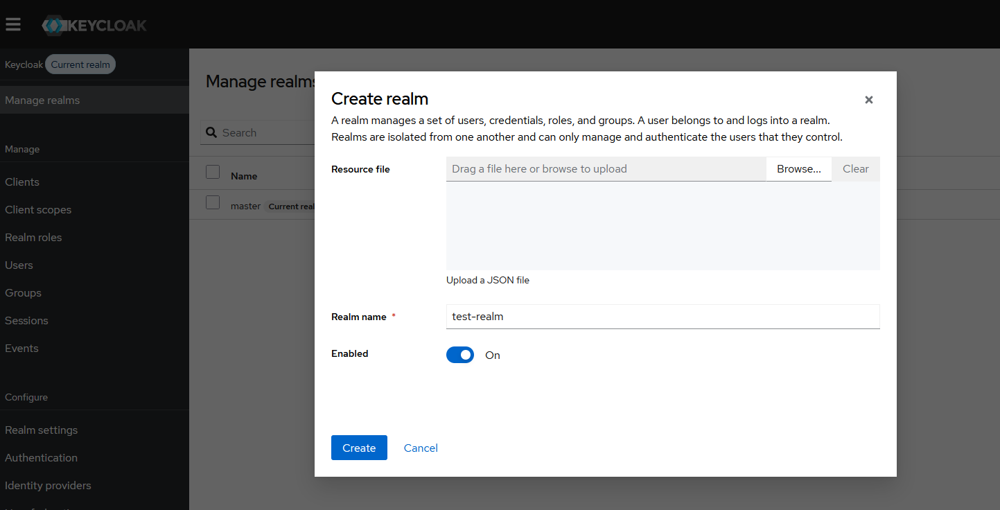
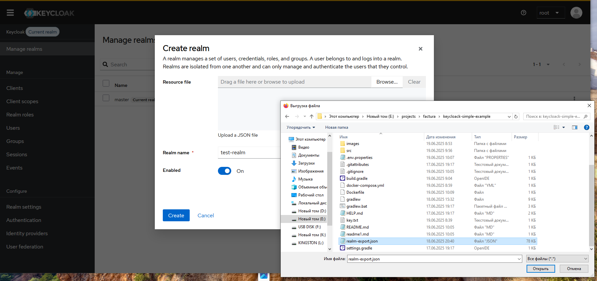
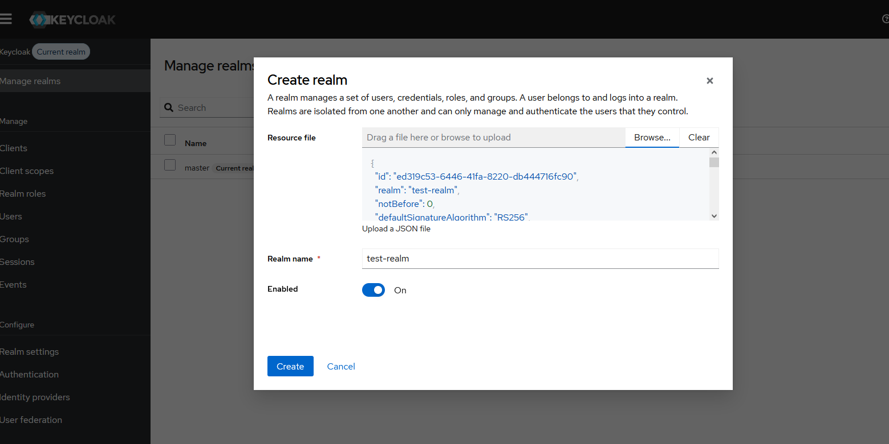
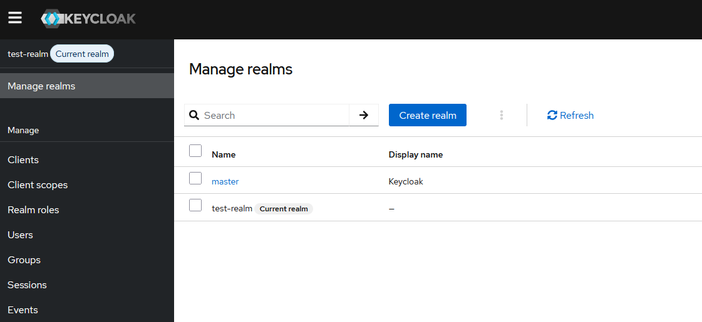
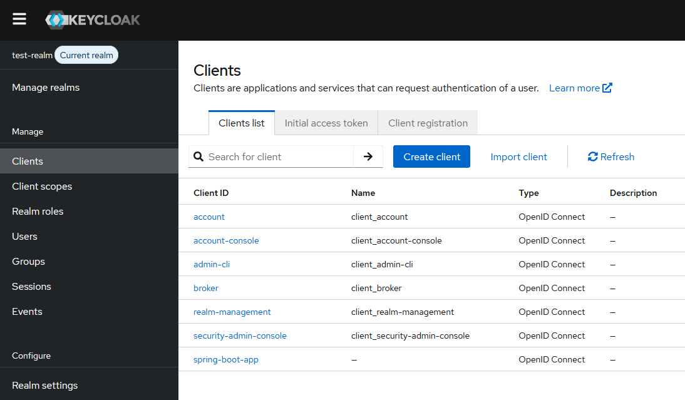
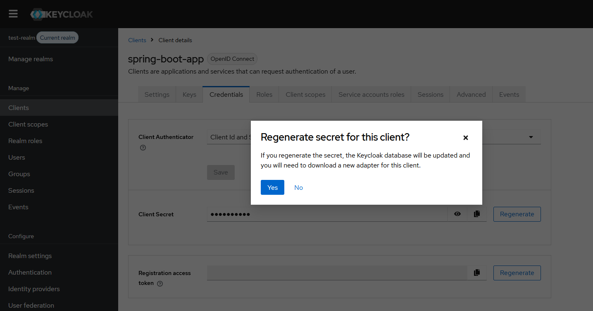
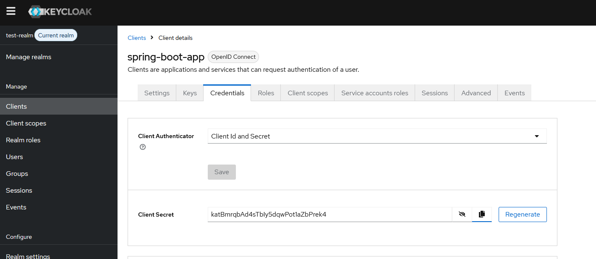

# Инструкция по запуску Keycloak и Spring Boot приложения

## Предварительные требования
- Установленный Docker Desktop

## Пошаговая инструкция

### Шаг 1: Запуск Keycloak
Запустите контейнер с Keycloak:
```bash
docker-compose up -d keycloak
```

### Шаг 2: Настройка Keycloak через админ-консоль
Проводим действия по настройке Keycloack.

Заходим в административную консоль:


Первоначально мы попадаем в master realm


Нам надо создать собственную realm. Для этого 
в меню выбираем пункт Manage realms и нажимаем кнопку Create realm:











### Шаг 3: Создание файла env.properties
Заполняем файл env.properties

### Шаг 4: Запуск Spring Boot приложения
Собираем и запускаем приложение
```bash
docker-compose build app
docker-compose up -d app
```
### Шаг 5: Проверка работоспособности приложения
Нам потребуется Postman.


`