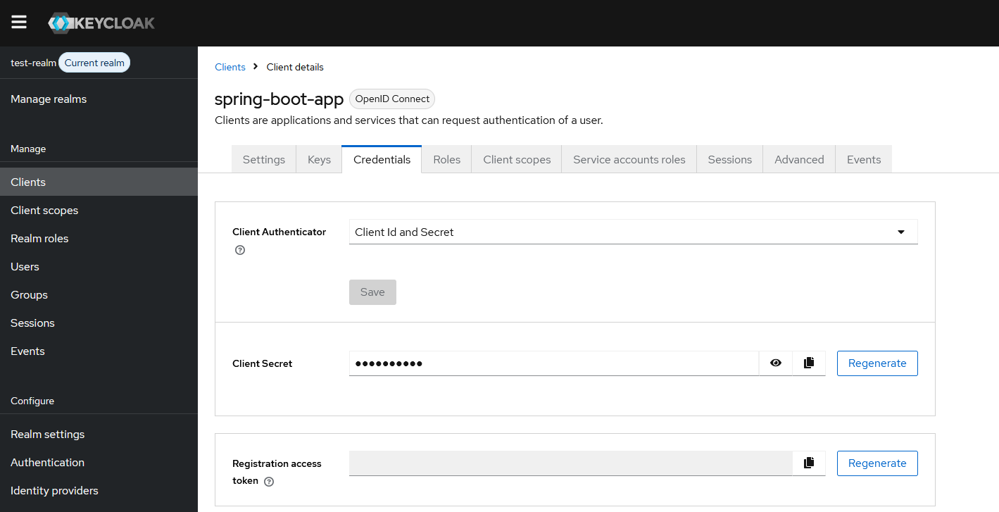

# Инструкция по запуску Keycloak и Spring Boot приложения
Приложение демонстрирует пример создания пользователя, его авторизации и доступа к защищенному ресурсу 
с использованием **KeyCloack** и **SpringBoot**.

Версии приложений: 

SpringBoot - **3.5.0**, 

KeyClock - **26.2.5**, 

библиотека **org.keycloak:keycloak-admin-client** версии **26.0.5** 

## Предварительные требования
- Установленный Docker Desktop

## Пошаговая инструкция

### Шаг 1: Запуск Keycloak
Запустите контейнер с Keycloak:
```bash
docker-compose up -d keycloak
```

### Шаг 2: Настройка Keycloak через админ-консоль
Проводим действия по настройке Keycloack.

Заходим в административную консоль:


Первоначально мы попадаем в master realm


Нам надо создать собственную realm. Для этого 
в меню выбираем пункт **Manage realms** и нажимаем кнопку **Create realm**:


Нам надо создать realm с именем test-realm.  
Для этого сначала вводим имя **test-realm** в поле **Realm name**:


Затем в поле Resource file загрузим json-файл с готовыми настройками realm.
Для этого нажмите кнопку **Browse** и выберите для загрузки файл **realm-export.json**. 
Он находится в корне проекта:


После загрузки json-файла проверьте, что переключатель **Enabled** находится в положении **ON**
и нажмите кнопку **Create**


Далее мы видим, что созданная нами test-realm становится текущей realm:


В главном меню (слева) выбираем пункт **Clients** и убеждаемся, что есть созданный нами через 
настройки json-файла клиент **spring-boot-app** 


Заходим в него и переходим на вкладку **Credentials**:

Так как при первоначальном создании клиента у него не сгенерирован секрет, 
то нам надо его сгенерировать. Для этого в поле **Client Secret** нажимаем на кнопку **Regenerate** 
и далее выбираем **Yes**: 

Сгенерированный секрет (katBmr....) копируем в буфер обмена. Этот секрет понадобится нам в следующих настройках.


### Шаг 3: Создание файла env.properties
Заполняем файл env.properties.
Этот файл находится в корне проекта, он уже предзаполнен. Надо только добавить сохраненный на предыдущем шаге секрет в свойство по ключу
KEYCLOAK_SECRET

### Шаг 4: Запуск Spring Boot приложения
Собираем и запускаем приложение
```bash
docker-compose build app
docker-compose up -d app
```
### Шаг 5: Проверка работоспособности приложения
Приложение будет запущено на порту **8090**. Для проверки работоспособности  
нам потребуется Postman.


`